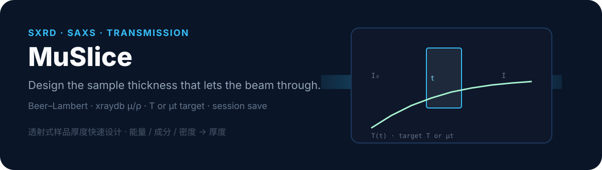
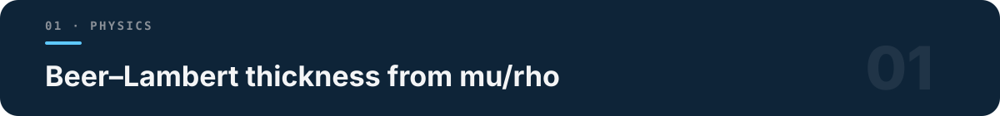
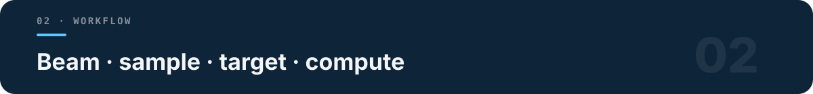

<p align="center">
  
</p>

# MuSlice

**Design the sample thickness that lets the beam through.**

[](LICENSE)
[](https://www.python.org/downloads/)
[](pyproject.toml)

Beginner-friendly desktop tool for **transmission SXRD / SAXS** thickness design. Beer–Lambert law + elemental \((\mu/\rho)\) from [xraydb](https://xraypy.github.io/XrayDB/) → thickness from energy, composition, density, and target transmittance \(T\) or optical depth \(\mu t\).

Optional window/air stacks, detector *Q*/*d* coverage, and relative exposure scaling.

中文：透射式 SXRD/SAXS 样品厚度快速设计器（基于 Beer–Lambert 与 xraydb 元素衰减系数）。

<p align="center">
  
</p>

## Features (v1.0.0)

- Mass or atomic composition; alloy presets
- Density models — prefer **measured density** when available
- Multi-layer transmission budget (Kapton / Be / quartz / air)
- Detector *Q*/*d* coverage helper
- Relative exposure scaling (ratio guide, not absolute flux)
- Session JSON I/O and `.txt` / `.md` reports

## Install / Quick start

```bash
git clone https://github.com/D-sudoasd/MuSlice.git
cd MuSlice
pip install -r requirements.txt
# or: pip install -e .
python -m muslice          # Windows: run.bat
```

Optional theme: `pip install sv-ttk`  
Example session: `examples/session_83keV_Ti2448.json`  
Physics notes: `docs/PHYSICS.md`

## Usage

<p align="center">
  
</p>

1. **Beam** — energy or wavelength  
2. **Sample** — alloy preset or composition; prefer measured density  
3. **Target** — \(T\) or \(\mu t\)  
4. **Layers** — Kapton / Be / quartz stacks  
5. **Compute** — thickness + \(T\)–\(t\) curve · **Save session** JSON  

Shortcuts: `Ctrl+Enter` compute · `Ctrl+S` export · `Ctrl+O` load · `F1` help

## Scientific boundary — what it is NOT

- Density quality **dominates** accuracy — wrong ρ → wrong thickness
- Exposure tool is a **relative ratio guide**, not absolute beamtime prediction
- Uses simple Beer–Lambert formulas only (no full Monte-Carlo ray tracing)
- Flat orthogonal detector model for *Q*/*d* coverage
- Not a scattering simulator, sample changer planner, or safety interlock

## License

MIT · Cite **xraydb** (Elam / Chantler tables) when publishing derived thicknesses or attenuation results.
