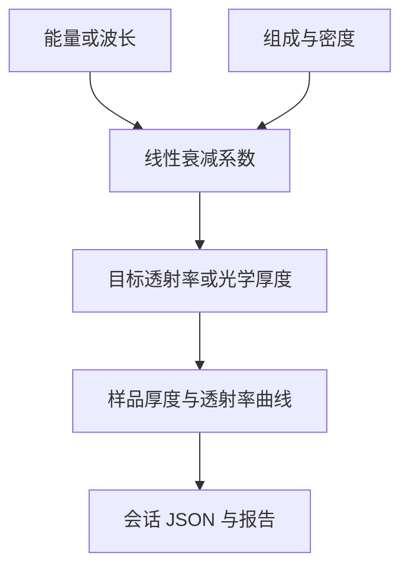

# MuSlice

**用能量、组成、密度与目标透射率，估算透射式 SXRD / SAXS 样品厚度。**

A desktop thickness-design tool based on Beer–Lambert attenuation and elemental mass attenuation coefficients from xraydb. Intended for planning sample thickness before a transmission experiment.

[安装与启动](#install--quick-start) · [操作顺序](#usage) · [83 keV Ti2448 示例](examples/session_83keV_Ti2448.json) · [物理定义](docs/PHYSICS.md)

[](LICENSE) [](pyproject.toml)


```mermaid
flowchart TD
  A[能量或波长] --> C[线性衰减系数]
  B[组成与密度] --> C
  C --> D[目标透射率或光学厚度]
  D --> E[样品厚度与透射率曲线]
  E --> F[会话 JSON 与报告]
```

仓库会话示例使用 **83 keV、Ti–24Nb–4Zr–8Sn 质量组成、手动密度 5.5 g/cm³ 和目标透射率 0.5**。这些是示例输入，不是对实测密度或实验结果的认证。可另计窗口与空气层的透射预算、探测器覆盖范围和相对曝光比例。优先输入实测密度。

## Features (v1.0.0)

- Mass or atomic composition; alloy presets
- Density models — prefer **measured density** when available
- Multi-layer transmission budget (Kapton / Be / quartz / air)
- Detector *Q*/*d* coverage helper
- Relative exposure scaling (ratio guide, not absolute flux)
- Session JSON I/O and `.txt` / `.md` reports

## Install / Quick start

```bash
git clone https://github.com/D-sudoasd/MuSlice.git
cd MuSlice
python -m pip install -e .
python -m muslice          # Windows: run.bat
```

The editable install includes the runtime dependencies and makes the `src/muslice` package importable. Installing only `requirements.txt` does not install the package; for that source-only route, use `run.bat` on Windows or set `PYTHONPATH=src` before running the module. Python must include `tkinter`.

Optional theme: `pip install sv-ttk`  
Example session: `examples/session_83keV_Ti2448.json`  
Physics notes: `docs/PHYSICS.md`

## Usage

<p align="center">
  
</p>

1. **Beam** — energy or wavelength  
2. **Sample** — alloy preset or composition; prefer measured density  
3. **Target** — \(T\) or \(\mu t\)  
4. **Layers** — Kapton / Be / quartz stacks  
5. **Compute** — thickness + \(T\)–\(t\) curve · **Save session** JSON  

Shortcuts: `Ctrl+Enter` compute · `Ctrl+S` export · `Ctrl+O` load · `F1` help

## Scientific boundary — what it is NOT

- Density quality **dominates** accuracy — wrong ρ → wrong thickness
- Exposure tool is a **relative ratio guide**, not absolute beamtime prediction
- Uses simple Beer–Lambert formulas only (no full Monte-Carlo ray tracing)
- Flat orthogonal detector model for *Q*/*d* coverage
- Not a scattering simulator, sample changer planner, or safety interlock

## License

MIT · Cite **xraydb** (Elam / Chantler tables) when publishing derived thicknesses or attenuation results.
